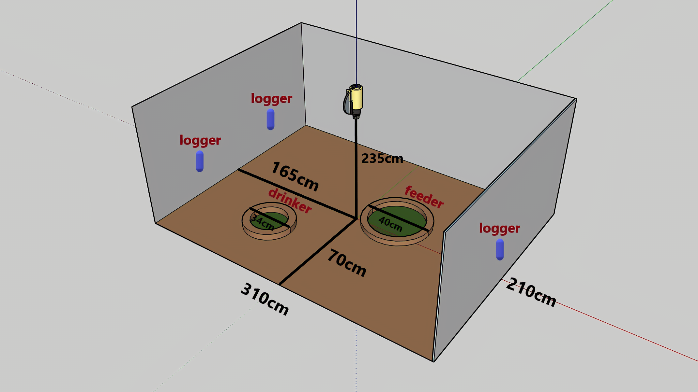
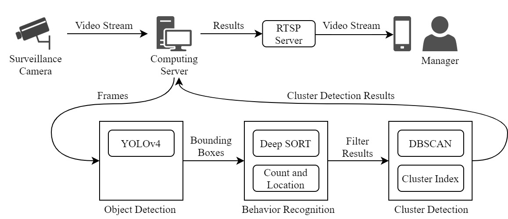
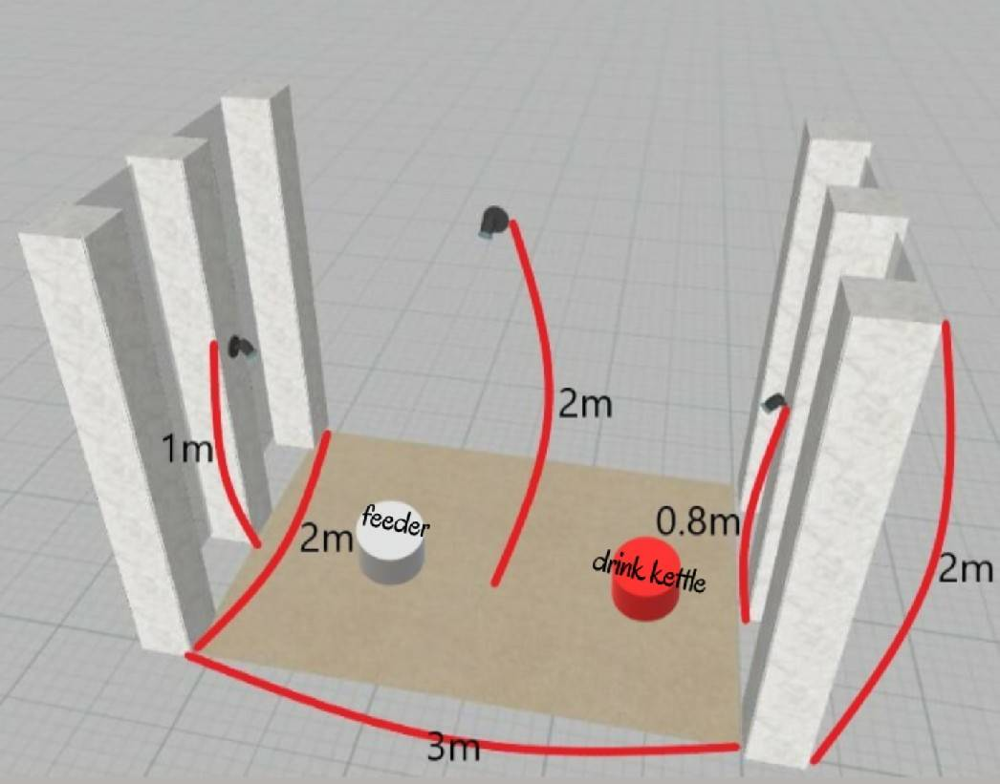
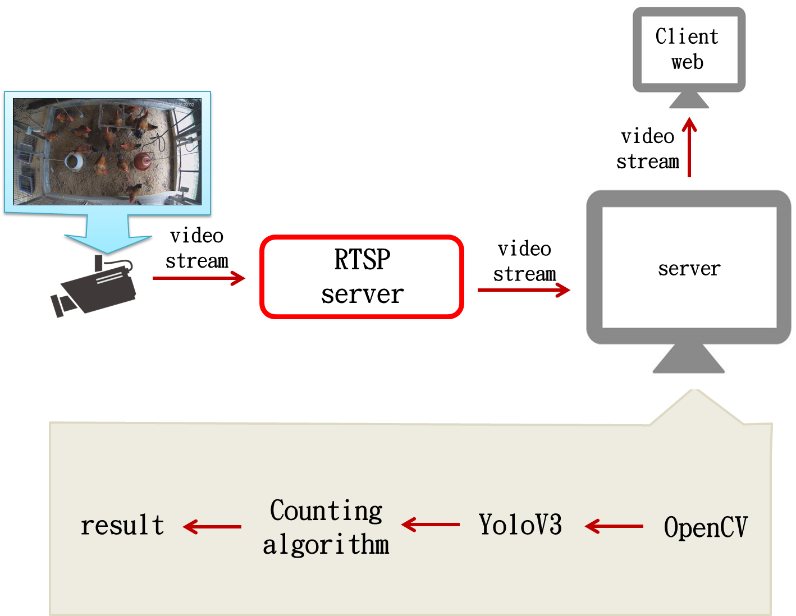
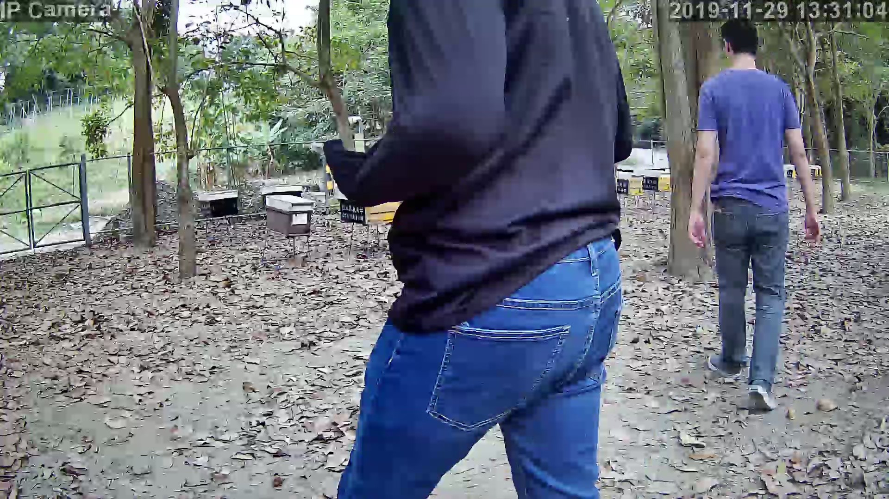
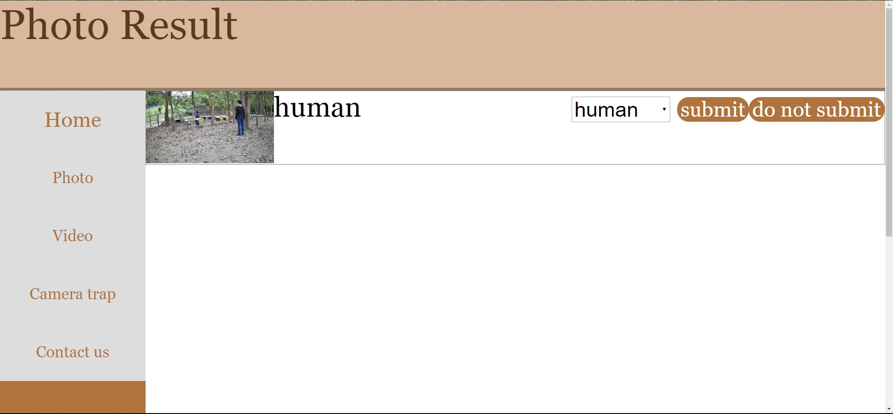

<h2 style="text-align: center">Research</h2>

<h2 style="text-align: center">2020 Porjects</h2>

<h3 style="text-align: left">Automatic Recognition of Broiler Flock Distribution with Object Detection and Clustering Technology</h3>

* Description: In this work, we introduce an automated method that combines deep object detection technology and cluster analysis techniques to monitor the flock distribution in a broiler house. We also present a cluster index to indicate the spatial distribution of the broilers. In the experiments, the results show that the proposed monitoring approach can provide the information about the spatial distribution of broilers, and the cluster index has high
correlations with the ambient temperature and humidity in the poultry house.
* Collaborators:
  * Li-Yi Mao
  * Kun-Hsing Chiang
* Publication:
  * Li-Yi Mao, Kun-Hsing Chiang, and Wen-Chieh Fang. "Automatic recognition of broiler flock distribution with object detection and clustering technology." In Proceedings od twenty-fifth Conference on Technologies and Applications of Artificial Intelligence (TAAI 2020), 2020.
 

<h3 style="text-align: left">Real-time aquarium fish part detection and localization</h3>

<!---->
<!---->

* Description: 利用人工智慧技術輔助水族館展覽與魚類養殖是個新穎的趨勢。本研究建構一個觀賞魚缸做為研究的原型,透過部位偵測與定位的技術,即時提供展示魚類的部位資訊與知識於數位螢幕上,達到輔助展示的效果。本研究的部位偵測與定位方法, 在模型訓練階段,採用卷積神經網路 (Convolutional Neural Network, CNN) 對魚類圖片資料進行卷積,接著採用 Hypercolumn 的技術將取樣的像素樣本表示成高維度的資料,最後以這些像素樣本訓練像素分類器。在展示階段,利用訓練好的像素分類器偵測與定位出魚缸中觀賞魚的目標部位。目前初步研究的進展為標註觀賞魚的訓練圖片,並以 Poisson Matting 的方法來修正非目標部位的像素點的標註資訊。此外,我們以鳥類圖片對部位偵測與定位模型做評估,初步發現 Hypercolumn 的方法對系統即時性是一個負擔。
* Collaborators:
  * Jiao-Chuan Huang 
  * You-Lin Lin
* Publication:
  * Jiao-Chuan Huang, You-Lin Lin, and Wen-Chieh Fang. Real-time aquarium fish part detection and localization. In Proceedings of the sixteenth Taiwan Conference on Software Engineering (TCSE 2020), 2020.
 

<h2 style="text-align: center">2019 Porjects</h2>

<h3 style="text-align: left">Real-time broiler monitoring with YOLO-based detection techniques</h3>

* Description: In this work, a real-time YOLO-based broiler monitoring system was implemented and evaluated for use in a broiler house to detect broiler locations and to count the broilers. The experimental results show that the proposed monitoring system can successfully perform the broiler detection
and counting and it can draw the bounding boxes on the detected broilers and show the estimated count number on the screen.
* Collaborators:
  * Guei-Mei Lin
  * Pei-Hua Huang
* Publication:
  * Guei-Mei Lin, Pei-Hua Huang, Ching-Hsien Chao, Cheng-Ta Chiang, and Wen-Chieh Fang, "Real-time broiler monitoring with YOLO-based detection techniques," In Proceedings of the twenty-fourth Conference on Technologies and Applications of Artificial Intelligence (TAAI 2019), 2019.
 

<h3 style="text-align: left">Real-time Bee Farm Security/Warning System with ResNet techniques</h3>

* Description: In this study, we built up a real-time human detection system based on convolutional neural networks in the deep learning field for prevention of beehive burglar and enhancement of forest beekeeping security. We collected training image data from a traditional camera surveillance system installed in the experimental bee farm. Afterwards, the digital image data were linked to our human detection model from which we can establish the security system for prevention of beehive burglar within the forest. 
* Collaborators:
  * Pin-Hao Chen
  * Yu-Zhe Ou

